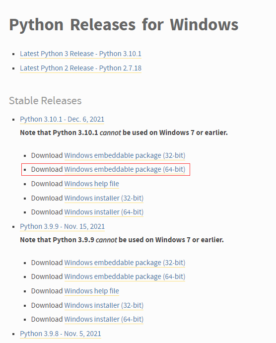
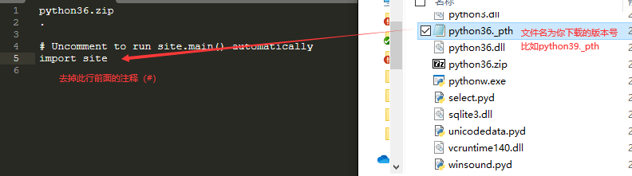
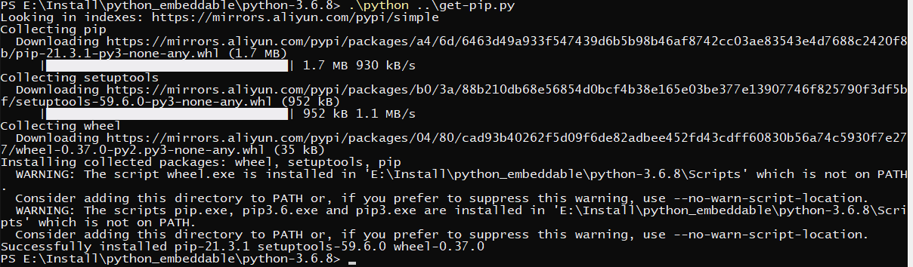
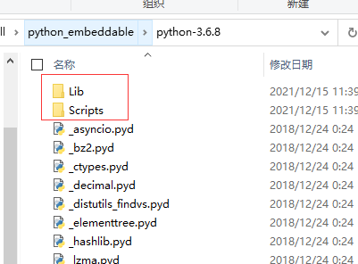
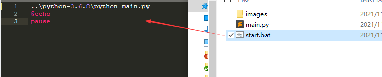

## 安装配置
1、从[官网](https://www.python.org/downloads/windows/)下载你想要的python的embed版本，并解压到python-3.6.8文件夹

      
2、去掉python程序包中`python36._pth`文件中`import site`前面的注释

      
3、从[https://bootstrap.pypa.io/get-pip.py](https://bootstrap.pypa.io/get-pip.py)下载get-pip.py文件

4、执行get-pip.py(注意此处使用的是本地路径.\python 和 ..\get-pip.py)
      ` .\python ..\get-pip.py`
      

	   
	执行成功后可在python-3.6.8文件夹看到多出了一些文件
	   

	   
	到此基本环境已添加完毕，如要添加其他python扩展库，可使用命令`.\Scripts\pip install xxxxx`进行安装
5、建议在项目入口文件（main.py）添加启动脚本start.bat

